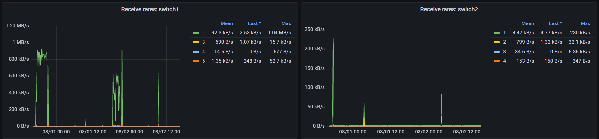
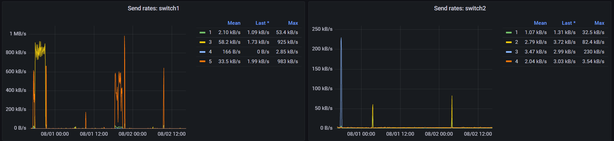
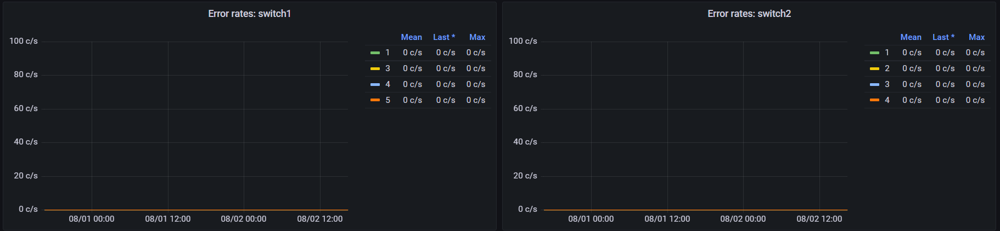

## About nsdp-telegraf-plugin
This [Telegraf](https://github.com/influxdata/telegraf) input plugin gathers statistics from NSDP ([Netgear Switch Discovery Protocol](https://en.wikipedia.org/wiki/Netgear_Switch_Discovery_Protocol)) capable devices.

### Installation
To install the plugin you have to download a suitable [release archive](https://github.com/hdecarne-github/nsdp-telegraf-plugin/releases) and extract it or build it from source by cloning the repository and issueing a simple
```
make
```
To build the plugin, Go version 1.18 or higher is required. The resulting plugin binary will be written to **./build/bin**.
Copy the either extracted or built plugin binary to a location of your choice (e.g. /usr/local/bin/telegraf/).

### Configuration
This is an [external plugin](https://github.com/influxdata/telegraf/blob/master/docs/EXTERNAL_PLUGINS.md) which has to be integrated via Telegraf's [excecd plugin](https://github.com/influxdata/telegraf/tree/master/plugins/inputs/execd).

To use it you have to create a plugin specific config file (e.g. /etc/telegraf/nsdp.conf) with following template content:
```toml
[[inputs.nsdp]]
  ## The target address to use for NSDP processing
  # target = "255.255.255.255:63322"
  ## The device limit to use (0 means no limit)
  # device_limit = 0
  ## The receive timeout to use (in seconds)
  # timeout = 2
  ## Enable debug output
  # debug = false
```
While this default config is most likely sufficent to already run the plugin, setting the **device_limit** to the maximum number of devices you are about to monitor, is advised. Without this setting, the plugin will always wait for **timeout** seconds until a scan is considred complete.

To enable the plugin within your Telegraf instance, add the following section to your **telegraf.conf**
```toml
[[inputs.execd]]
  command = ["/usr/local/bin/telegraf/nsdp-telegraf-plugin", "-config", "/etc/telegraf/nsdp.conf", "-poll_interval", "10s"]
  signal = "none"
```
#### Port Statistic stats
The current port statistic is reported via the **nsdp_port_statistic** measurement:
```
nsdp_port_statistic,nsdp_device_ip=10.1.1.2,nsdp_device_model=GS108Ev3,nsdp_device_name=switch1,nsdp_device_port=1,nsdp_device_port_id=switch1:1 packets=0i,broadcasts=0i,multicasts=0i,errors=0i,received=3397944961i,sent=412888900i 1659415843955167000
```
Every port having a non-zero received or sent value is reported.







### License
This project is subject to the the MIT License.
See [LICENSE](./LICENSE) information for details.